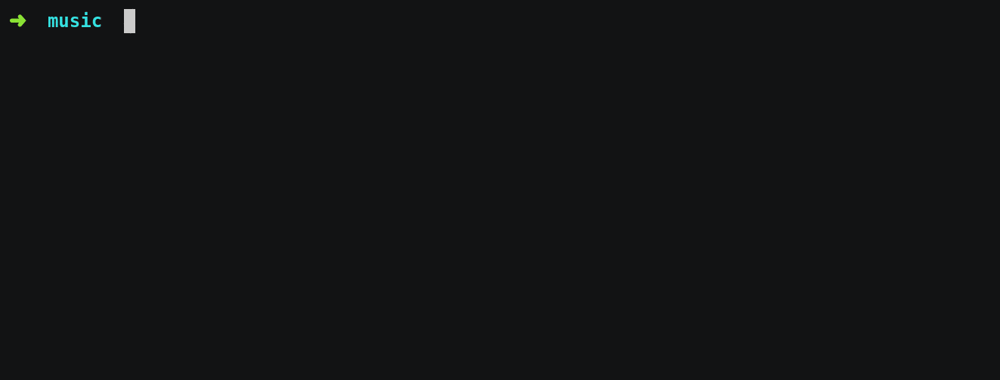

<p align="center">

<br>
<a href="https://travis-ci.org/schollz/spotifydownload"></a> 
<a href="https://gocover.io/github.com/schollz/getsong"></a>
<a
href="https://github.com/schollz/spotifydownload/releases/latest"></a> </p>

<p align="center">Automatically download your Spotify playlists.</p>

*spotifydownload* is an [open-source](https://github.com/schollz/spotifydownload) tool that makes it easy to download your Spotify playlists, using [getsong](https://github.com/schollz/getsong) to find the corect song and download it and convert it to an mp3.



Unlike other downloaders, there are no dependencies (other than ffmpeg which will automatically be installed onto your system when running the first time).

# Install

Get the [latest release](https://github.com/schollz/spotifydownload/releases/latest) or install with `go get`:

```
go get github.com/schollz/spotifydownload
```

# Usage


To run simply do

```bash
$ spotifydownload
```

and you'll be prompted with instructions to get the Spotify URL link. To get the Spotify URL link you can right click on the playlist. If you are using the Desktop client, then you'll see a button "Shared > 🔗 Copy Playlist Link", or in the Web browser you'll see "Copy Playlist Link". Clicking that will copy the Spotify Playlist link to the clipboard.


If you already know your playlist URL you can enter it:

```bash
$ spotifydownload -playlist PLAYLIST_URL
```

Now you can easily schedule this to run using `crontab`, just edit it with `crontab -e` and add the line:

```
0 0 * * 0 cd /folder/to/spotifydownload &&  ./spotifydownload --playlist PLAYLIST_URL
```

which will execute it every 7 days so that you will never lose any songs in your Release Radar or Discover Weekly.

## Contributing

Pull requests are welcome. Feel free to...

- Revise documentation
- Add new features
- Fix bugs
- Suggest improvements


## License

MIT

